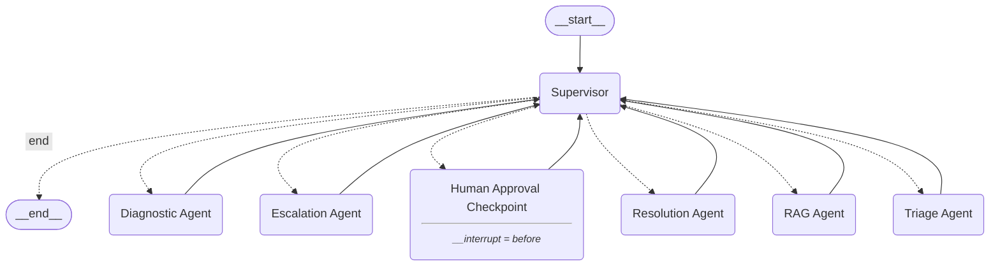

# 🏗️ System Architecture

## Overview
The system follows a highly modular, decoupled architecture consisting of a **FastAPI** backend layer, a **Streamlit** frontend interface, and a **LangGraph** core intelligence layer.

## 1. Intelligence Layer (`agents/`)
The core orchestrator is a **StateGraph** managed by a Supervisor.

### Agent Workflow (Mermaid Graph)

### Components
- **State**: `TicketState` (TypedDict) maintains conversation memory, diagnostics, category, priority, and confidence.
- **Supervisor**: Intelligently routes the graph state to the next worker node using `llama-3.1-8b-instant`.
- **Interrupts**: Native LangGraph `checkpointer` (MemorySaver) persists threads per `ticket_id`, pausing execution safely at the `human_approval` edge.

## 2. API Layer (`api/`)
Built with **FastAPI**.
- Exposes RESTful endpoints (`/tickets/`, `/tickets/{id}/trace`, `/tickets/{id}/approve`).
- Graph invocations are handed off to `BackgroundTasks` to prevent blocking.
- Interfaces via SQLAlchemy to persist basic ticket metadata to Postgres/SQLite.

## 3. RAG Layer (`rag/`)
- **Embeddings**: Local, cost-free HuggingFace sentence transformers (`all-MiniLM-L6-v2`).
- **Vector DB**: Chroma DB persisting to `./rag/vectorstore`.
- **Verification**: Dedicated Hallucination Checker ensures generated resolutions are grounded in the retrieved operational contexts.

## 4. Presentation Layer (`frontend/`)
Built with **Streamlit** using multipage architecture.
- Fetches real-time trace data to dynamically render Agent thought processes.
- Includes embedded Plotly analytics for visualizing IT metrics.
